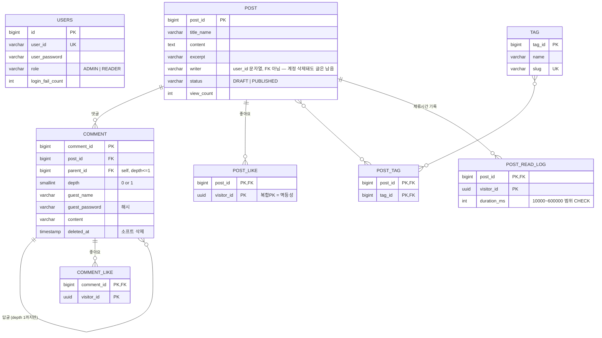

# DK's Lab — 아키텍처 인수인계 문서

이 문서는 `blueprint-view`(프론트엔드)를 처음 맡는 개발자를 대상으로 한다.
"무엇이 있는지"보다 "왜 이렇게 되어 있는지"와 "건드릴 때 뭘 조심해야 하는지"에
무게를 뒀다. 코드 자체는 대부분 잘 주석돼 있으니, 이 문서는 그 주석들을
가로질러 전체 그림을 잇는 역할을 한다.

## 1. 한눈에 보기

이 프로젝트는 **저장소 두 개 + 배포처 두 곳**으로 이루어진다.

| | 프론트엔드 (`blueprint-view`) | 백엔드 (`blueprint-back`) |
|---|---|---|
| 스택 | React 19 + TypeScript + Vite | Spring Boot (Java) + PostgreSQL |
| 배포 | Vercel (`main` 브랜치 푸시 → 자동 배포) | 개발자 개인 데스크탑 (Docker + Cloudflare Tunnel) |
| 도메인 | dk-lab.dev | api.dk-lab.dev |

**가장 먼저 이해해야 할 것**: 이 사이트는 성격이 다른 두 부분으로 쪼개져 있다.

- **포트폴리오/소개 페이지(`/`, `/about`)** — 완전히 정적이다. 프로젝트 목록,
  스킬, 이력서 본문이 전부 `src/data/mockData.tsx`에 하드코딩돼 있고 백엔드를
  전혀 호출하지 않는다. 내용을 바꾸려면 이 파일을 고치고 다시 배포하면 된다.
- **블로그(`/blog/*`)** — 실제 백엔드(Spring Boot + PostgreSQL)와 통신하는
  유일한 부분이다. 글, 댓글, 좋아요, 태그, 조회수/읽기시간 계측이 전부 여기
  속한다.

이 구분을 모르고 "블로그처럼 API 연동 패턴을 쓰겠지"라고 포트폴리오 쪽을
건드리면 헛수고를 하게 된다.

## 2. 백엔드는 어디서 도는가 (중요)

백엔드는 클라우드가 아니라 **개발자의 개인 데스크탑**에서 돈다. 로컬에서
프론트엔드를 개발하려면 `blueprint-back` 저장소의 스택을 먼저 띄워야 한다.

```
C:\workspace\blueprint-back> .\run-stack.ps1
```

이 스크립트는 Docker Desktop → PostgreSQL 컨테이너(`blog-db`) → Spring Boot
jar → Cloudflare Tunnel(`cloudflared`) 순서로 "없는 것만" 띄운다(멱등). 정상
동작을 위해 사용자 환경변수 `JWT_SECRET`(32바이트 이상)이 미리 설정돼 있어야
한다. `register-startup-task.ps1`로 Windows 작업 스케줄러에 등록해 두면
로그온 시 + 10분마다 자동으로 상태를 점검하고 죽은 것을 되살린다(`DKLab-Stack`
작업).

로컬 프론트엔드 개발 시 `axiosInstance.ts`는 `http://localhost:8080/api/v1`을
기본으로 바라본다(`VITE_API_BASE_URL`로 재정의 가능). 백엔드가 안 떠 있으면
블로그 관련 화면은 전부 `ErrorState`(연결 실패) 화면을 띄운다 — 프론트엔드
버그가 아니라 백엔드 미기동일 가능성을 먼저 의심할 것.

## 3. 리포지토리 구조 (프론트엔드)

```
src/
├── pages/                  라우트에 매핑되는 최상위 화면 (PortfolioPage, AboutPage, Blog/*)
├── router/AppRouter.tsx    라우트 정의. 모든 페이지가 lazy(). RequireAdmin으로 관리자 구간 보호
├── features/
│   ├── portfolio/          홈 화면 섹션들 (Hero, Projects, Skills, ...) — 전부 정적 데이터 소비
│   ├── blog/                블로그 기능 (에디터, 댓글, 사이드바, 목록 카드, 훅)
│   └── auth/                로그인 폼, RequireAdmin 가드
├── components/
│   ├── layout/               Navigation, SharedLayout, PageTransition 등 전역 레이아웃
│   └── common/                재사용 UI (Modal, Dialog, WindowFrame, SectionMarker, MarqueeText ...)
├── services/                axios 호출을 감싸는 얇은 API 클라이언트 (postService, commentService, ...)
├── schemas/                  Zod 스키마 + 그로부터 추론한 타입. 서버 응답 검증까지 겸함
├── store/                    Zustand 전역 스토어 (useAuthStore, useErrorStore) — 딱 두 개뿐
├── api/                       axios 인스턴스, 토큰 저장/갱신, 에러 정책
├── data/mockData.tsx          포트폴리오 정적 콘텐츠 (프로젝트, 이력서, 네비 항목)
└── constants/styles.ts        디자인 토큰 (COMMON_STYLES / GLASS_STYLES)
```

## 3.1 화면별 컴포넌트 트리

실제 렌더 트리를 그대로 옮긴 것이다. 괄호 안은 그 컴포넌트가 하는 일.

```
App (세션 복구 1회 실행)
└─ SharedLayout (배경 + sticky Navigation, 블로그 경로는 max-w 확장)
   └─ AppRouter (경로별 lazy 페이지, AnimatePresence로 전환 애니메이션)

/  PortfolioPage
   ├─ Notice                모바일에서만 5초 노출되는 "PC 권장" 안내 토스트
   ├─ Hero                  섹션 01. 이름/소개/Hire·이메일복사 + 상태 배지(RUNTIME 등, 정적)
   ├─ Projects              섹션 02. WindowFrame("projects.ts") + ProjectItem 리스트
   │  ├─ ProjectItem × N       featured 항목은 좌측 accent 바 + FEATURED 배지
   │  └─ Modal (선택 시)        WindowFrame(닫기 버튼) + 비고정 헤더 + 섹션 3개
   │     ├─ SectionMarker × 3    01 Main Job / 02 Achievements / 03 Technologies
   │     └─ TagChip × N          기술스택과 겹치는 블로그 태그 → "관련 글" 진입점
   ├─ Skills                섹션 03. 클릭 시 매칭되는 블로그 태그 또는 검색으로 이동
   ├─ FooterCTA / Social / FooterInfo   섹션 04 + 정적 마무리 블록

/about  AboutPage
   └─ ReactMarkdown(RESUME_CONTENT)   h1/h2 커스텀 렌더러로 프로필 헤더·섹션 번호 처리

/blog  BlogListPage
   └─ BlogLayout
      ├─ Sidebar (lg 이상에서만)        태그별 글 수, useBlogNavigation 데이터
      └─ PostCard × N (또는 PostCardSkeleton)
      └─ FAB "새 글 작성" (isAdmin만, /blog/write로 이동)

/blog/tags/:slug, /blog/search  →  같은 PostCard 리스트를 재사용, 조회 함수만 다름

/blog/:id  PostDetailPage
   ├─ MarkdownContent(post.content)   상세와 에디터 미리보기가 공유하는 렌더 규칙
   ├─ LikeButton (target="post")
   ├─ useReadTimeTracker              체류 시간 측정 → sendBeacon으로 서버 전송
   └─ CommentSection
      ├─ CommentForm / CommentEditForm
      ├─ CommentItem × N (답글은 depth 1, 들여쓰기로만 표현)
      │  └─ LikeButton (target="comment")
      └─ ConfirmDialog(관리자) / PasswordPromptDialog(비회원)  삭제 확인 분기

/blog/write, /blog/:id/edit  BlogEditorPage  (RequireAdmin 뒤)
   └─ FormProvider (react-hook-form + zod)
      ├─ EditorHeader     edit/split/preview 모드 전환, 임시저장·발행 버튼 분리
      ├─ TagInput         칩 UI, 폼 필드 아닌 별도 state
      ├─ EditorPanel      제목 input + 마크다운 textarea, useImageUpload(붙여넣기/드래그)
      ├─ EditorPreview    MarkdownContent 재사용 실시간 미리보기
      └─ useDraftAutosave 새 글 작성 중에만 500ms 디바운스로 localStorage 자동저장
```

## 3.2 핵심 공용 컴포넌트 — Props와 책임

`src/components/common/`에 있는, 여러 화면이 공유하는 컴포넌트들이다.

| 컴포넌트 | Props | 책임 |
|---|---|---|
| `Modal` | `project, onClose` | 프로젝트 상세 표시. 내부에 `WindowFrame`(유일한 sticky) + 스크롤되는 헤더/본문. iOS-safe body 스크롤 락 포함 |
| `WindowFrame` | `filename, className?, onClose?` | macOS 창 프레임(트래픽라이트+파일명). `onClose`를 주면 우측에 X 버튼 렌더 |
| `SectionMarker` | `index, label, className?` | `01 // LABEL` 코드 인덱스 스타일 섹션 라벨 |
| `MarqueeText` | `text, className?, containerHeight?` | 정적 ellipsis 레이어 + 호버 전용 스크롤 레이어의 2단 구조 |
| `ErrorState` (+`ERROR_ACTION_STYLES`) | `icon, code?, label?, title, description, actions?` | 404/403/네트워크 오류 화면을 한 모양으로 통일 |
| `Dialog` / `ConfirmDialog` / `PasswordPromptDialog` | 각기 다름 | 공용 대화상자 뼈대 위에 확인/비밀번호 입력 변형을 얹은 것 |
| `LiquidToast` | `isVisible, message, variant?` | 하단 토스트. `useToast` 훅과 짝을 이룸 |
| `AppErrorDialog` | (전역 1회 마운트) | `useErrorStore`를 구독해 어느 화면에서 던진 오류든 같은 대화상자로 표시 |

블로그 전용 공용 컴포넌트(`src/features/blog/components/`):

| 컴포넌트 | Props | 책임 |
|---|---|---|
| `LikeButton` | `target: 'post'\|'comment', targetId, initialCount, initialLiked, onError?, size?` | 좋아요 토글. 낙관적 ±1이 아니라 서버가 돌려준 최종 카운트로 교체 |
| `MarkdownContent` | `children: string` | 글 본문 렌더 규칙(코드 하이라이트, 이미지 오리진 보정)을 상세/미리보기가 공유 |
| `TagChip` | (태그 요약 + 카운트) | 태그 배지. Modal의 "관련 글", Sidebar 등에서 재사용 |
| `PostCard` / `PostCardSkeleton` | `post` / — | 목록 카드와 그 로딩 스켈레톤 |

## 3.3 에디터 서브시스템 상세

`BlogEditorPage`는 작성/수정을 **한 컴포넌트로 겸한다** — 라우트에 `id`가
있으면 수정, 없으면 작성이며 두 흐름은 초기값 소스와 저장 API만 다르다.

- **폼**: `react-hook-form` + `zodResolver(postFormSchema)`. 저장 시에는
  `postWriteRequestSchema`로 다시 파싱해 `status`/`tags`를 더한 뒤 전송 —
  `writer`는 절대 담지 않는다(서버가 토큰 주체로 결정, 클라이언트 값은 무시됨).
- **태그**는 폼 필드가 아니라 별도 `useState<string[]>`. react-hook-form의 배열
  필드보다 칩 추가/삭제 UI를 직접 다루는 편이 단순하다는 판단(`TagInput`).
  `toSlug()`로 서버의 정규화 규칙(소문자, 공백→하이픈)을 화면에서 미리
  흉내 내 중복을 막지만, 최종 판정은 서버가 한다.
- **자동저장(`useDraftAutosave`)은 새 글 작성 모드에서만 동작한다.** 수정
  모드에서 로컬 초안을 복원하면, 다른 곳에서 고친 서버 원본을 오래된 로컬
  값이 조용히 덮어쓸 위험이 있기 때문 — 이미 서버에 있는 글은 자동저장
  대상에서 의도적으로 제외된 것이니, "수정 화면에도 자동저장이 있어야
  하는데"라고 생각하고 섣불리 켜지 말 것.
- **이미지 업로드(`useImageUpload`, `EditorPanel`이 사용)**는 textarea에
  붙여넣기/드래그로 들어온다. 업로드된 이미지는 호스트 없는 상대 경로로
  저장되고, `MarkdownContent`의 `img` 렌더러가 `resolveAssetUrl`로 API
  오리진을 붙여 완성한다 — 이미지가 안 보이면 이 조합(저장 경로 vs
  렌더링 시점 오리진 결합)부터 의심할 것.
- **저장 버튼이 "임시저장"과 "발행" 두 개로 분리**돼 있다. 하나만 두면 쓰다 만
  글이 그대로 공개되는 것 외에 선택지가 없기 때문.
- **모드는 edit/split/preview 세 가지.** `EditorPreview`가 `MarkdownContent`를
  그대로 재사용하므로 "에디터 미리보기랑 실제 글이 다르게 보인다"는 버그가
  생길 수 없는 구조다 — 렌더 규칙을 두 군데에 따로 두고 싶어질 때 이 원칙을
  기억할 것.

## 3.4 댓글 서브시스템 상세

- **트리 깊이는 1로 고정**이며 이는 DB 제약(`comment_depth_range`)까지 걸린
  하드 규칙이다. `CommentReply`(최상위/답글 공통 타입)를 답글에도 그대로
  써서 "답글의 답글" UI 자체가 존재하지 않는다.
- **삭제는 소프트 삭제.** 답글이 달린 댓글을 물리 삭제하면 답글이 부모를
  잃기 때문. 화면은 `comment.deleted`를 보고 "삭제된 댓글입니다"만 표시한다.
- **삭제 확인 UX가 권한에 따라 갈린다**: 관리자는 `ConfirmDialog`(비밀번호
  없이 확인만), 비회원은 `PasswordPromptDialog`(작성 시 비밀번호 재입력).
- **비밀번호 관련 오류(M002 불일치, M010 시도 초과)는 폼/대화상자를 닫지
  않고 자리에서 표시한다.** 닫아 버리면 수정 중이던 내용을 다시 입력해야
  하기 때문 — `CommentSection.handleActionError`의 `INLINE_ERROR_CODES`
  분기가 이 규칙을 담당한다. 새로운 인라인 처리 대상 에러 코드가 생기면
  이 Set에 추가하면 된다.
- **댓글 작성 폼에 허니팟 필드(`website`)가 숨어 있다.** 사람 눈에는 안
  보이고 봇만 채우는 함정 입력으로, CAPTCHA 없이 스팸을 거른다.

## 4. 데이터 흐름과 상태 관리 — CLAUDE.md와 실제 코드의 차이

`CLAUDE.md`는 서버 상태에 TanStack Query를 쓰라고 권장하지만, **실제로는
설치돼 있지 않다(`package.json`에 없음)**. 실제 패턴은 이렇다:

- **인증 상태**: `useAuthStore` (Zustand). 라우트 가드·네비게이션이 렌더
  시점에 동기적으로 읽어야 해서 비동기 캐시보다 단순한 동기 스토어를 택했다는
  설명이 스토어 파일 상단에 명시돼 있다.
- **블로그 목록/사이드바 데이터**: TanStack Query 없이 `useBlogNavigation.ts`
  같은 **직접 짠 모듈 스코프 캐시**(TTL 60초, in-flight 중복 요청 병합)로
  처리한다. 새 서버 상태를 추가할 때 이 패턴을 그대로 복제하지 말고, 규모가
  커지면 이 시점에 TanStack Query 도입을 재검토하는 게 맞다(지금은 화면
  종류가 적어 과했다는 판단으로 보인다).
- **폼 상태**: React Hook Form + Zod resolver (`@hookform/resolvers`).
- **UI 로컬 상태**: 그냥 `useState`. 전역화하지 않는다.

새 기능을 붙일 때 "이 상태를 어디에 둘지" 판단 기준은 `CLAUDE.md` 8장 그대로
유효하다 — 다만 "TanStack Query" 자리에 실제로는 "직접 짠 캐시 훅"이 들어가
있다는 점만 염두에 둘 것.

## 5. 인증 — 알아야 위험을 안 만드는 부분

```
로그인 → 서버가 JWT 발급(기본 1시간) → localStorage 저장
       → 매 요청 전 axios 인터셉터가 "만료 5분 전"이면 조용히 재발급(슬라이딩 세션)
       → 만료된 토큰은 재발급 불가 → 401 → 토큰 폐기 → 재로그인 유도
```

- **리프레시 토큰이 없다.** 의도적 설계다(`tokenRefresh.ts` 주석 참고) — 리프레시
  토큰도 결국 브라우저에 저장해야 해서 XSS 노출 면적이 같은데 회전·폐기 로직만
  늘어난다는 판단. 활성 사용 중에만 슬라이딩 갱신하는 지금 방식으로 충분하다고
  본다.
- **토큰 수명이 짧은(기본 1시간) 이유도 의도적이다.** `tokenStorage.ts`가
  `localStorage`를 쓰는데, XSS가 나면 토큰이 그대로 노출되므로 수명을 짧게 잡아
  피해 범위를 줄인다. **이 값을 편의를 위해 크게 늘리면 이 보안 전제가
  깨진다** — 늘릴 필요가 있으면 사용자와 트레이드오프를 반드시 논의할 것
  (백엔드 `application.yaml`의 `app.jwt.expiration-seconds`, 기본값 3600).
- **`RequireAdmin`은 UX 가드일 뿐이다.** 실제 권한 판정은 서버가 매 요청 JWT를
  검증해서 한다. 프론트엔드 가드를 아무리 정교하게 짜도 그 자체로는 아무것도
  보호하지 않는다 — 새 관리자 기능을 추가할 때 서버 쪽 권한 체크를 빼먹지 말 것.
- **주의**: `RequireAdmin.tsx`와 일부 옛 주석은 "Supabase RLS가 실제 권한을
  통제한다"고 적혀 있는데, 이는 **낡은 설명이다**. `package.json`에
  `@supabase/supabase-js`가 남아 있고 `CLAUDE.md`도 Supabase를 권장 방향으로
  적어 두었지만, 실제 인증·인가는 자체 Spring Boot 백엔드의 JWT(HS256)로
  완전히 이전되어 있다. Supabase 관련 문구를 문서적 사실로 신뢰하지 말 것.

## 6. ERD (백엔드 실제 스키마)

`blueprint-back`의 `V1__baseline_schema.sql`을 그대로 옮긴 것이다. Flyway로
관리되며 `ddl-auto: validate` — 엔티티와 스키마가 어긋나면 기동이 실패한다.



설계에서 눈여겨볼 결정들 (전부 마이그레이션 SQL 주석에 근거가 적혀 있다):

- **`post.writer`는 FK가 아니라 문자열.** 계정이 삭제돼도 글은 남아야 하기
  때문. 사용자 삭제 기능을 만들 때 이 전제가 깨지지 않는지 확인할 것.
- **댓글은 깊이 1까지만.** 답글의 답글이 없다. `comment_depth_range` /
  `comment_depth_parent_match` CHECK 제약이 DB 레벨에서 이를 강제한다. 대댓글의
  대댓글 기능을 요청받으면 스키마부터 바꿔야 한다.
- **좋아요/댓글좋아요는 별도 테이블.** `target_type` 컬럼으로 하나의 테이블에
  합치지 않은 이유는 그러면 FK를 못 걸어 참조 무결성을 애플리케이션이 떠안게
  되기 때문. 새로운 "반응" 종류(북마크 등)를 추가할 때도 같은 원칙을 따를 것.
- **좋아요/체류시간은 `visitor_id`(서버 발급 UUID 쿠키) 기준.** IP는 Cloudflare
  Tunnel 뒤에서 전부 동일하게 보여 식별자로 못 쓴다.
- **`post_read_log`는 방문자당 한 행, "더 긴 값으로만" 갱신.** 평균 읽기 시간을
  글자 수 추정이 아니라 실측으로 낸다는 결정.

## 7. 디자인 시스템

`src/constants/styles.ts`의 `COMMON_STYLES` / `GLASS_STYLES`가 전역 톤을 쥐고
있다. 색상은 `tailwind.config.js`의 `colors.accent`(Tailwind `sky` 팔레트 별칭)
하나로 사이트 전체 포인트 컬러를 정의한다 — 리브랜딩이 필요하면 그 한 줄만
바꾸면 된다(과거에는 `indigo`를 하드코딩해서 흩어 썼는데, 이번에 토큰화했다).

이번 세션에서 새로 생긴 공용 컴포넌트:

- **`SectionMarker`** — `01 // LABEL` 형태의 코드 인덱스 스타일 섹션 라벨. 예전의
  글로우 점(dot) 마커를 대체했다.
- **`WindowFrame`** — macOS 창 프레임 흉내(트래픽 라이트 + 파일명 탭). Projects
  카드와 프로젝트 상세 Modal에 쓰인다. `onClose`를 선택적으로 받아 닫기 버튼을
  그릴 수 있다.

`MarqueeText`(좁은 공간에 긴 텍스트를 넣는 컴포넌트)는 정적 말줄임표 레이어 +
호버 전용 스크롤 레이어의 2단 구조다. 호버가 없는 터치 기기를 고려해 이렇게
분리했으니, 비슷한 걸 새로 만들 때 호버 하나에만 의존하지 말 것.

## 8. 이번 세션에서 실제로 겪은 버그와 교훈

프론트엔드를 만지다 보면 또 마주칠 수 있는 것들이라 구체적으로 남긴다.

### 8.1 `tailwind.config.js`에 `xs` 브레이크포인트가 없다

Tailwind 기본 팔레트에는 `xs` 스크린이 없는데, 코드 곳곳(`hidden xs:inline`
같은)이 이게 정의돼 있다고 가정하고 쓰였다. **정의 안 된 Tailwind variant는
빌드 에러 없이 조용히 무시된다** — 그 클래스가 항상 "기본 상태"로 굳어버려서,
겉보기엔 반응형처럼 보이지만 실제로는 화면 크기와 무관하게 항상 같은 상태로
렌더링된다. `ProjectItem`의 `ACTIVE` 배지가 이 버그로 영구히 숨어 있다(이번
세션에서 발견만 하고 수정은 보류함 — 필요하면 `sm:`으로 바꾸거나 `xs` 스크린을
직접 정의할 것). 비슷하게 안 보이는 요소를 만나면 이것부터 의심할 것.

### 8.2 sticky + backdrop-filter + overflow-hidden 조합은 iOS WebKit에서 위험하다

`Modal.tsx`에서 실제로 겪은 문제. 스크롤 가능한 모달 안에 `position: sticky`
요소를 backdrop-blur와 함께, 그것도 **두 층(서로 다른 top 오프셋)으로 겹쳐서**
쓰자 iOS Safari/Chrome(둘 다 내부는 WebKit)에서 스크롤 중 이전 프레임이 유령처럼
겹쳐 보이는 렌더링 버그가 발생했다. 시도해서 **효과 없었던** 방법들: `-webkit-
mask-image` 클리핑 트릭, `overscroll-behavior: contain`, iOS-safe body 스크롤
락(`position: fixed` 트릭), sticky 요소의 `backdrop-blur` 제거. **실제로
해결된 방법은 sticky 요소를 하나로 줄이는 것**(구조 단순화)이었다. 교훈:

- 모달/시트 안에서 sticky를 여러 층으로 쌓지 말 것. 필요하면 하나만.
- sticky 요소에는 `backdrop-filter`를 웬만하면 걸지 말 것.
- 이런 버그는 데스크톱 Chrome(Playwright 포함)에서 **재현되지 않는다.** 모바일
  레이아웃 확인은 반응형 크기 조절만으로는 부족하고, 의심되면 실기기(특히
  iOS) 스크린샷으로 확인해야 한다.

### 8.3 정의되지 않은 Tailwind 클래스가 조용히 아무것도 안 한다

`Modal.tsx`가 `scrollbar-hide`라는, 플러그인도 없고 정의도 안 된 클래스를 쓰고
있었다(스크롤바가 실제로는 숨겨지지 않고 있었음). Tailwind는 모르는 클래스를
에러 없이 그냥 버린다 — 오타나 삭제된 플러그인 클래스가 남아 있어도 빌드가
알려주지 않는다. 클래스를 추가했는데 효과가 없으면, 오타/미정의 여부를 먼저
Tailwind 설정에서 확인할 것.

### 8.4 호버 전제 UI는 터치 기기에서 조용히 망가진다

`MarqueeText`(위 7장)와 `Navigation`의 `SearchBar`가 원래 `hover`에만
의존했다. 마우스가 없는 기기에서는 그 상태에 영영 도달하지 못한다 — 에러도 안
나고 그냥 그 기능이 없는 것처럼 보인다. 새 인터랙션을 짤 때 "터치에서는 이
호버 상태를 어떻게 트리거하지?"를 항상 자문할 것.

### 8.5 좁은 화면에서 flex 요소가 조용히 사라질 수 있다

`Navigation`의 우측 액션 영역(검색·로그인·테마·Hire 버튼)이 컨테이너보다
넓어지면 `overflow-hidden` 때문에 통째로 잘려 안 보였다(에러 없음, 레이아웃
깨짐도 안 보임 — 그냥 없음). 데스크톱 너비 기준으로 짠 flex 레이아웃은 실제
좁은 폰(360~390px)에서 내용이 다 들어가는지 반드시 확인할 것. 안전장치로
`overflow-x-auto` + 스크롤바 숨김을 fallback으로 깔아 두면 "완전히 사라짐"
대신 "가로로 살짝 스크롤 가능"으로 완화할 수 있다.

## 9. 배포

- **프론트엔드**: GitHub `main` 브랜치에 푸시하면 Vercel이 자동으로 프로덕션
  배포한다(Git 연동, Vercel 대시보드에서 수동 배포 불필요). `vercel.json`은
  SPA 라우팅을 위한 rewrite 규칙만 담고 있다.
- **백엔드**: 수동 배포 개념이 아니라 "항상 떠 있어야 하는 로컬 서비스"다.
  코드를 바꾸면 `gradlew bootJar`로 새 jar를 빌드하고, 기존 프로세스를 내린 뒤
  `run-stack.ps1`이 다시 띄우게 해야 한다(스케줄 작업이 자동으로 재기동하진
  않는다 — "안 떠 있으면 띄운다"이지 "새 버전으로 교체"는 아니다).

## 10. 기능을 추가하기 전에

1. **정적 콘텐츠(포트폴리오)인가, 서버 데이터(블로그)인가**를 먼저 구분한다.
   전자는 `mockData.tsx`를 고치면 끝, 후자는 프론트+백엔드 양쪽을 봐야 한다.
2. 서버 상태를 새로 다룬다면 `useBlogNavigation.ts` 패턴(모듈 스코프 캐시)을
   그대로 베끼기보다, 화면이 몇 개나 그 상태를 공유하는지 먼저 가늠할 것 —
   많아지면 TanStack Query 도입을 검토할 시점이다.
3. 관리자 전용 기능은 **반드시 서버 쪽에도 권한 체크를 넣는다.** 프론트엔드
  가드(`RequireAdmin`)는 UX 편의일 뿐 보안 경계가 아니다.
4. 모바일 레이아웃은 최소 360px 폭 기준으로 실제 좁은 화면에서 확인한다.
   가능하면 실기기(특히 iOS)로 한 번은 확인 — 이 문서 8장의 버그들은 전부
   데스크톱 브라우저에서는 멀쩡해 보였다.
5. 새 Tailwind 클래스를 썼는데 효과가 없으면, 오타나 `tailwind.config.js`에
   없는 variant/color인지부터 의심한다(8.1, 8.3 참고).
6. DB 스키마를 바꾼다면 새 Flyway 마이그레이션(`V2__...`)을 추가한다.
   `ddl-auto: validate`라 엔티티만 고치고 마이그레이션을 빼먹으면 기동이
   실패한다.
